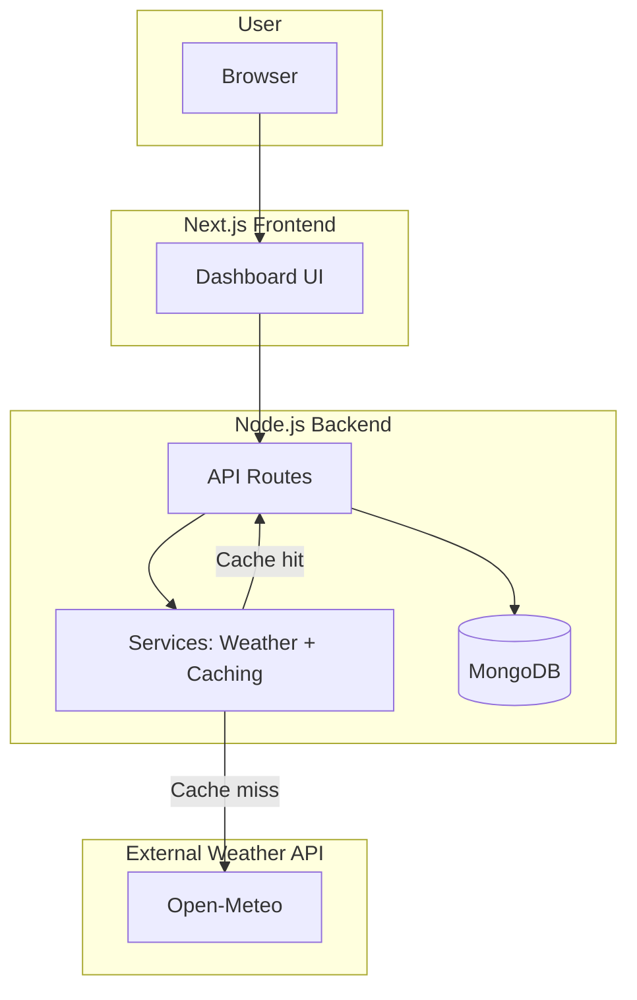
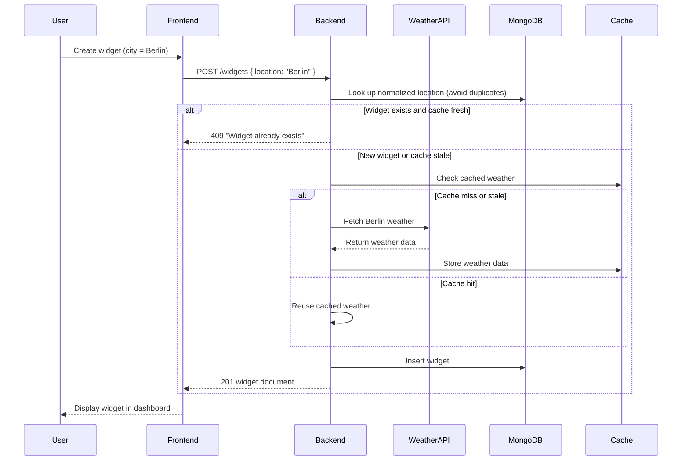

# Weather Widget Dashboard

A full-stack application that allows users to create and manage weather widgets for different cities. Each widget displays live weather data fetched from an external weather service.

## Features
- Create multiple widgets for different cities (e.g., Berlin, Hamburg, Paris).
- Each widget shows live, up-to-date weather data.
- Automatic caching: if a city’s data has been retrieved within the last 5 minutes, cached values are returned.
- Widgets can be deleted.

## Quick Start
1. Ensure you have the required dependencies installed (see below).
2. Start the backend server.
3. Start the frontend server.
4. Open the dashboard at [http://localhost:3000](http://localhost:3000).

## Prerequisites
- Node.js v18+
- MongoDB (local or via MongoDB Atlas)
- NPM or Yarn

## Setup Instructions

### Backend Setup
```bash
cd backend
npm install
cp .env.example .env
npm run dev
```

`backend/.env` must define at least:

```env
MONGO_URI=mongodb://localhost:27017/widgets
PORT=5000
```

The API is served at [http://localhost:5000](http://localhost:5000).

### Frontend Setup

```bash
cd frontend
npm install
echo "NEXT_PUBLIC_API_URL=http://localhost:5000" > .env.local
npm run dev
```

The dashboard runs at [http://localhost:3000](http://localhost:3000);
adjust `.env.local` if your API lives elsewhere.

## Usage

* Navigate to the dashboard UI.
* Create widgets by specifying a city (e.g., “Berlin”).
* Weather data will be fetched from the backend.
* Delete widgets when no longer needed.

## API Description

### Widget Endpoints

| Method | Endpoint       | Description                    |
| ------ | -------------- | ------------------------------ |
| GET    | `/widgets`     | Retrieve all saved widgets     |
| POST   | `/widgets`     | Create a new widget (location) |
| DELETE | `/widgets/:id` | Delete widget by ID            |

### Data Model

```json
{
  "_id": "string",
  "location": "string",
  "createdAt": "ISODate"
}
```

### Weather Data Source

Weather data is retrieved on demand from [Open-Meteo](https://open-meteo.com/) (no API key required). If a location was queried in the last 5 minutes, cached data held on the backend is returned instead of calling the external API again.

## Architectural Overview
The system is split into a **Next.js frontend** and an **Express/MongoDB backend** with a built-in in-memory cache.

- **Frontend**: Provides the dashboard interface where users manage widgets.
- **Backend**: Express routes handle widget CRUD, enforce duplicate/validation logic, and orchestrate weather lookups before persisting data.
- **Cache**: An in-memory cache within the backend avoids repeated weather calls for 5 minutes.
- **Database**: MongoDB stores widget metadata (location, timestamps, normalized key).

### High-Level Architecture



### Sequence Diagram


